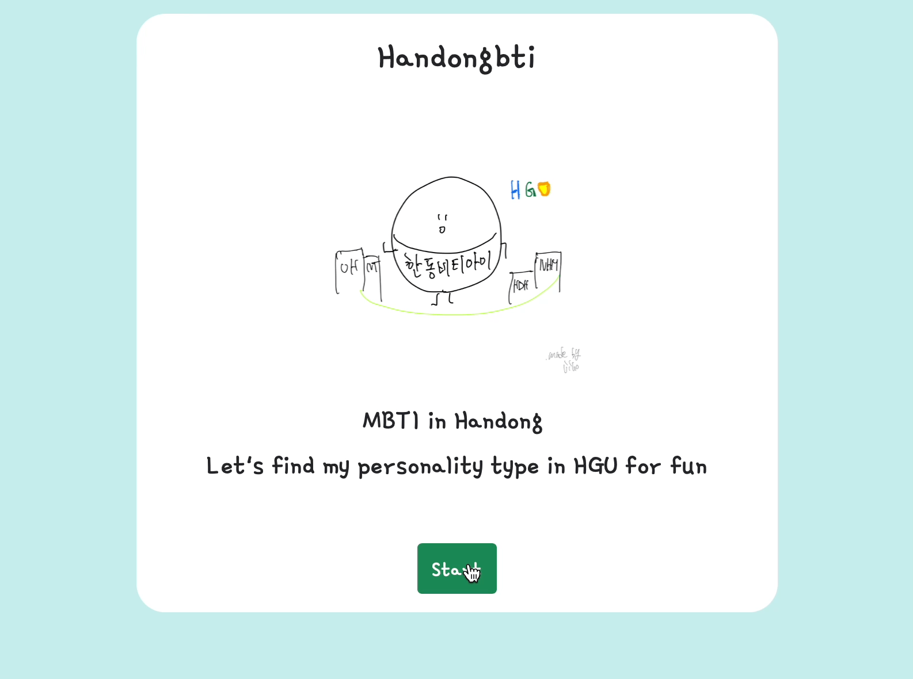
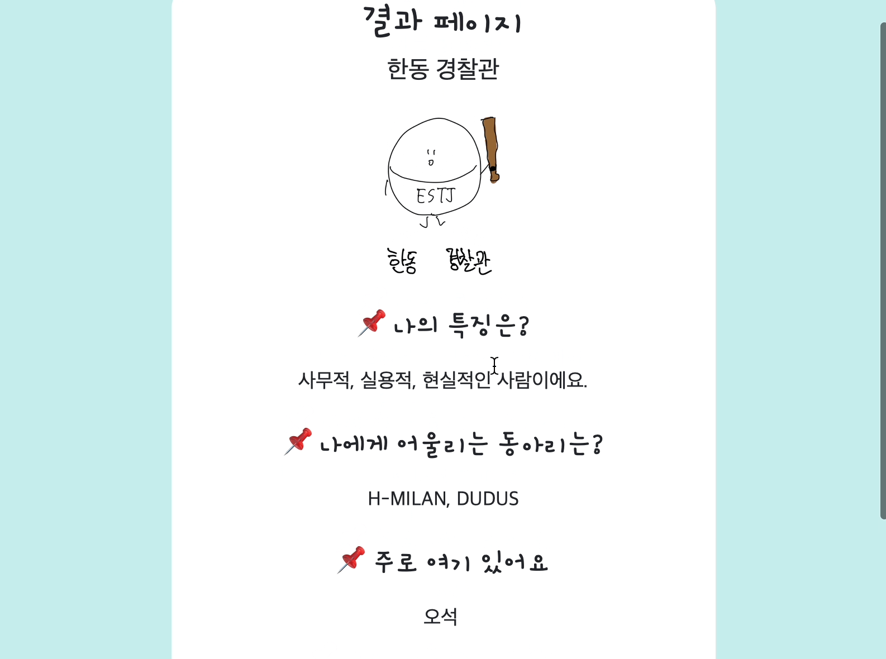
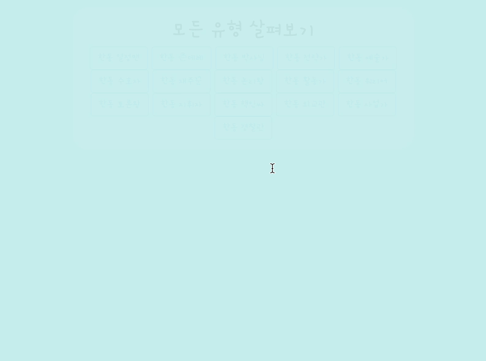

# 한동비티아이 (Handong + Club + MBTI)

## What does this project do?
---
Handong + Club + MBTI  

<!-- 요즘 유행하는 성격유형검사인 MBTI 검사를 기반으로 가볍게 즐길 수 있는 유형검사를 만들었습니다. 학생들은 자신의 성격 유형을 파악할 수 있으며, 이에 어울리는 동아리도 추천 해줍니다.  -->

Based on the MBTI test, a popular personality type test these days, I have created a type test that can be enjoyed lightly. Students can identify their personality types and recommend clubs that fit them.

The results of this test may differ from your actual personality, so you can enjoy it for fun!

## Why is this project useful? 
---
<!-- 성격유형검사를 통해 자기 이해가 가능합니다. 또한 서로의 성격유형을 공유하며 자신을 쉽게 소개할 수 있습니다. 요즘 젊은 세대 뿐 아니라 모든 세대들이 자신의 성격유형이 무엇인지에 대해 관심이 많습니다. -->
Self-understanding is possible through personality type tests. Also, we can share each other's personality types and introduce ourselves easily. Nowadays, not only the younger generation but also all generations are interested in what their personality type is.

You can find own personality type in Handong  
You can also find clubs that match your personality type

  
<!-- 이 검사의 결과는 실제 자신의 성격과 다를 수 있으므로 재미로 즐겨주시면 될 것 같습니다! -->

## Contribution
---
You can create your own type check by changing the data value after you take the code!

Some codes may not be efficient, but implementing simple features is no problem. (value, use key values to derive results, flip pages, click on buttons to move pages, etc.)

The Page Configuration and Question Selection functions referenced the following codes: https://github.com/nani6765/MyMBTI

## How to get started?
---
### Click the below button  

### If you want use own raspberrypi server

~~~bash
1. fork repository.

2. Turn on your raspberry pi.

3. $git clone https://github.com/zhoho/Oss_project.git

4. Move that file to /var/www/html.
~~~

## Page
---
## Start page

## select page

## result page

## alltype page

---

## Finally

- The club information is based on Handong University's website. (https://www.han.ac.kr/camplife/stu-organ/club/perform/)

- I couldn't put it in because I didn't get information about other clubs or academic societies. If you give me your opinion if you want, I will reflect it.

- I drew the characters. The surprising fact is that I don't major in design. 🤣

- It also runs on your phone, so share it with your friends and enjoy it

- I recommend using computer rather than cell phone. (Image size issue) 

- If you have any suggestions, Please leave your comments on github issues or send us an email! chlwlgh1011@naver.com

- Event: If you screenshot your results page and send it to me(mail), I will give small prizes to 2 people through a randomly. (Until today ~ 6/16 23:59)

<h2 id="License"align='center'>Copyleft / End User License</h2>

* [Apache License Version 2.0](https://github.com/zhoho/Oss_project/blob/master/LICENCE)
