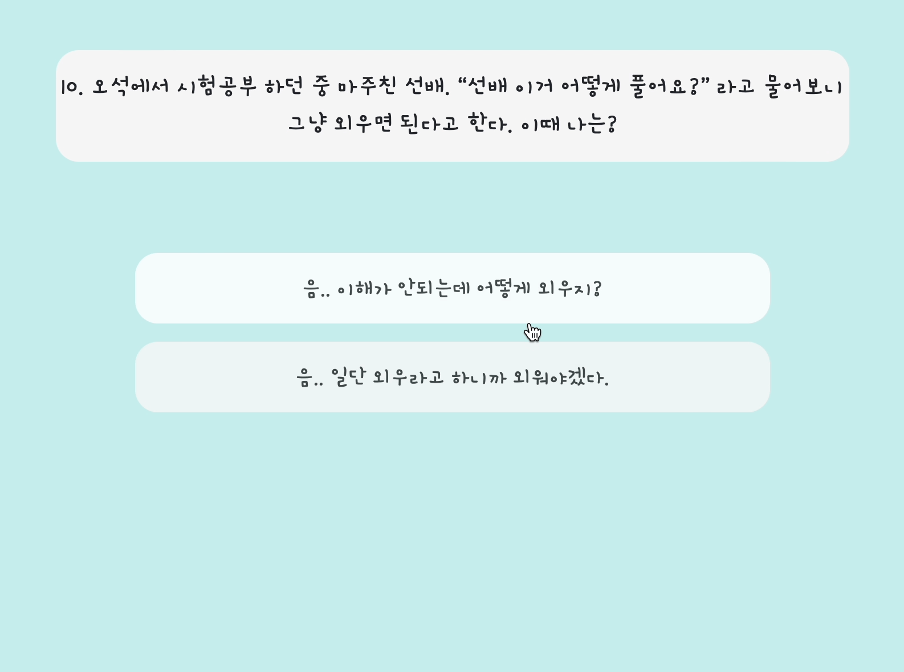

# HBTI (Handong + MBTI)
Find the club for you in Handong

## What does this project do?
---
한동대학교 + 동아리 + MBTI  

요즘 유행하는 성격유형검사인 MBTI 검사를 기반으로 가볍게 즐길 수 있는 유형검사를 만들었습니다. 학생들은 자신의 성격 유형을 파악할 수 있으며, 이에 어울리는 동아리도 추천 해줍니다. 

## Why is this project useful? 
---
성격유형검사를 통해 자기 이해가 가능합니다. 또한 서로의 성격유형을 공유하며 자신을 쉽게 소개할 수 있습니다. 요즘 젊은 세대 뿐 아니라 모든 세대들이 자신의 성격유형이 무엇인지에 대해 관심이 많습니다.  
이 검사의 결과는 실제 자신의 성격과 다를 수 있으므로 재미로 즐겨주시면 될 것 같습니다!
## How to get started?
---
https://handongbti.netlify.app 에서 검사해볼 수 있습니다! (6/9 기준 아직 수정 중)

## Where can people get more help, if needed?
---

github issues에 의견을 남겨주시거나 메일을 보내주시면 됩니다! chlwlgh1011@naver.com

---
## Start page

## select page

## result page

## alltype page

<h2 id="License"align='center'>Copyleft / End User License</h2>

* [Apache License Version 2.0](https://github.com/zhoho/Oss_project/blob/master/LICENCE)
